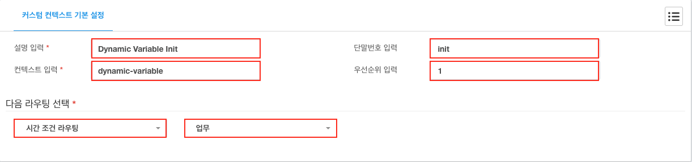

# DIPCAST - CUSTOM

Variable 사용 방법
***

### DIPCAST VOIP > 어플리케이션 > 커스텀 컨텍스트에 적용
>
> 1. 좌측 메뉴에 ```VOIP```를 클릭합니다.
> 1. 좌측 메뉴에 ```어플리케이션```을 클릭합니다.
> 1. 좌측 메뉴에 ```커스텀 컨텍스트```를 클릭합니다.
> 1. 아래의 내용을 각 항목에 맞게 입력합니다.
>       1. 설명 입력 : ```Dynamic Variable Init``` 임의의 설명을 반드시 ```영어```로 입력합니다.
>       1. 컨텍스트 입력 : ```dynamic-variable```
>       1. 단말번호 입력 : ```init```
>       1. 우선순위 입력 : ```1```
>       1. 다음 라우팅 선택 : ```모듈선택``` >  ```상세선택``` 다음에 실행할 수신모듈과 목록을 선택합니다. 
> 
>
> 변수 설명
> 1. SERVER 변수
>       1. ${DIPCAST-SERVER-PUBLICIP} : DIPCAST IP
>       1. ${DIPCAST-SERVER-EVENTURL} : 이벤트를 받을 주소
>
> 1. CHANNEL 변수
>       1. ${DIPCAST-CHANNEL-CIDNAME} : 발신자 표시이름
>       1. ${DIPCAST-CHANNEL-CIDNUMBER} : 발신자 표시번호
>       1. ${DIPCAST-CHANNEL-DIDNUMBER} : DID 번호
>       1. ${DIPCAST-CHANNEL-SERVICENUMBER} : 15XX, 16XX, 18XX 등 대표번호, 080 수신자 부담 번호 등 (한국 케이블 텔레콤:KCT 가입자만 가능)
>       1. ${DIPCAST-CHANNEL-LINKEDID} : 모든 채널 연결ID
>
>
> * [변수 사용 스크립트](resources/templates/extensions__61-1-dynamic-variable.conf)
