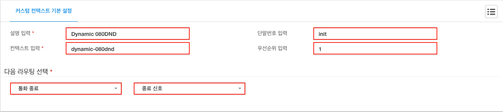

# DIPCAST - CUSTOM

080 수신 거부
***

### DIPCAST VOIP > 어플리케이션 > 커스텀 컨텍스트에 적용
>
> 1. 좌측 메뉴에 ```VOIP```를 클릭합니다.
> 1. 좌측 메뉴에 ```어플리케이션```을 클릭합니다.
> 1. 좌측 메뉴에 ```커스텀 컨텍스트```를 클릭합니다.
> 1. 아래의 내용을 각 항목에 맞게 입력합니다.
>       1. 설명 입력 : ```Dynamic 080DND``` 임의의 설명을 반드시 ```영어```로 입력합니다.
>       1. 컨텍스트 입력 : ```dynamic-080dnd```
>       1. 단말번호 입력 : ```init```
>       1. 우선순위 입력 : ```1```
>       1. 다음 라우팅 선택 : ```모듈선택``` >  ```상세선택``` 다음에 실행할 수신모듈과 목록을 선택합니다.
> 
>
> 옵션 설정
>
> 1. 환경 설정
>       1. ${DIPCAST-080DND-AUTO} : 발신자 표시번호 자동 등록 여부 (```1``` or ```0```)
>       1. ${DIPCAST-080DND-INTRO} : 인트로 사운드
>       1. ${DIPCAST-080DND-TEMINATED} : 통화종료 사운드
>
> 1. IVR 옵션
>       1. ${DIPCAST-080DND-RETRY} : 발신자 표시이름


> * [변수 사용 스크립트](resources/templates/extensions__62-1-dynamic-080dnd.conf)
