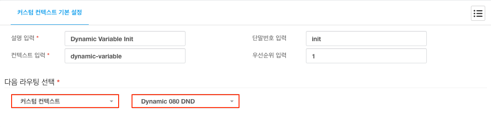

# DIPCAST - CUSTOM

080 수신 거부
***

### DIPCAST VOIP > 어플리케이션 > 커스텀 컨텍스트에 적용
>
> 1. 좌측 메뉴에 ```VOIP```를 클릭합니다.
> 1. 좌측 메뉴에 ```어플리케이션```을 클릭합니다.
> 1. 좌측 메뉴에 ```커스텀 컨텍스트```를 클릭합니다.
> 1. 아래의 내용을 각 항목에 맞게 입력합니다.
>       1. 설명 입력 : ```Dynamic 080 DND``` 임의의 설명을 반드시 ```영어```로 입력합니다.
>       1. 컨텍스트 입력 : ```dynamic-080dnd```
>       1. 단말번호 입력 : ```init```
>       1. 우선순위 입력 : ```1```
>       1. 다음 라우팅 선택 : ```모듈선택``` >  ```상세선택``` 다음에 실행할 수신모듈과 목록을 선택합니다.
> 
>
> 1. 아래와 같이 ```Dynamic Variable Init``` 커스텀 컨텍스트를 반드시 거치도록 설정합니다.
> 1. 수신 통화 처리 순서 : ```수신설정```  >```Dynamic Variable Init``` > ```Dynamic 080 DND```
> 
>
> 옵션 설정
>
> 1. 환경 설정
>       1. ${DIPCAST-CHANNEL-SERVICENUMBER} : 서비스 번호
>       1. ${DIPCAST-CHANNEL-INPUT-CIDNUMBER} : 080DND 등록번호
>       1. ${080DND-BRAND} : 재생할 파일 이름
>       1. ${080DND-TYPE} : 080DND 운영 방식, SHORT -> 수신 후 바로 번호 입력
>

|파일 이름| 재생 내용|
|:---------:|:---------:|
|hi | 안녕하세요|
|080-dnd-intro|마케팅 문자 메세지 수신거부 등록시스템입니다 |
|080-dnd-play-cidnumber-pre|고객님의 번호는|
|yipnida| 입니다|
|080-dnd-confrim-1-2|등록 번호가 맞으면 일번, 아니면 이번으로 눌러주세요 |
|080-dnd-incorrect | 입력번호가 다릅니다|
|080-dnd-timeout | 5초안에 입력해 주세요|
|080-dnd-input-number-short|등록을 원하는 번호를 입력하시고 우물정자를 누르세요|
|080-dnd-input-number|발송되는 문자 메세지에 대해 수신거부를 원하시면 고객님의 핸드폰 번호를 입력하신후 우물정자를 누르세요 |
|080-dnd-wrong-number|입력하신 번호가 고객정보와 일치 하지 않습니다. 다시 입력해 주세요|
|080-dnd-complete|수신거부 등록이 정상적으로 처리되었습니다|
|goodbye| 이용해 주셔서 감사합니다|
|080-dnd-end-retry|이용 방법을 확인하시고 다시 전화 주세요|
|080-dnd-wrong-mobile-number|등록 가능한 번호가 아닙니다. 다시 입력해 주세요 |
|080-dnd-play-inputnumber-pre | 입력하신  번호는|
|080-dnd-intro-brand|당신의 더 나은 커뮤니티 여정을 함께 하는 주식회사 얼쑤팩토리|

> * [변수 사용 스크립트](resources/templates/extensions__62-1-dynamic-080dnd.conf)
