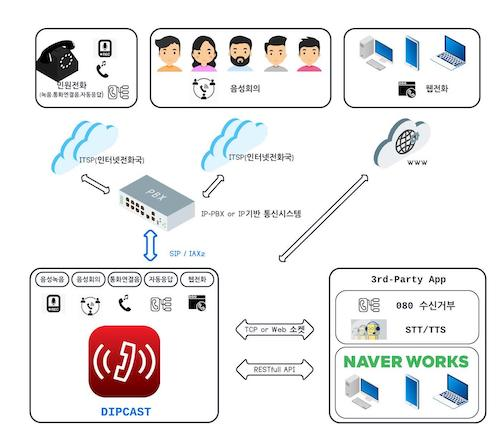

# DIPCAST - CUSTOM

Naver Works API 연동을 통해, 모바일 UC 환경 직접 구축하기
***
 

 

<b>DynamicIPCAST(다이나믹 아이피캐스트)</b>와 네이버 웍스 API 연동

당신의 더 나은 커뮤니케이션 여정을 함께합니다.

<b>주식회사 얼쑤팩토리</b>

대표번호 1668-2471

 
 

> # 문서 정보

| 항목 | 내용 |
|:---:|:---:|
| 버전 | 1.0 |
| 상태 | 완료 |
| 작성자 | 주식회사 얼쑤팩토리 |        

     
> # 목차  

가. 서비스 안내......3     
나. 제품 설치 환경......3     
다. 제품 개요 및 설명.....4     
라. 웹 기본......4     
마. 웹 메뉴......8     
>     
> 1. VOIP......8     
>  
> > 1.1 단말번호......8     
> > 1.2 어플리케이션......11     
> > 1.3 콜센터......14     
> > 1.4 외부연동......16     
> > 1.5 수신통화......21     
> > 1.6 도구......25     
> > 1.7 위치 알림......29     
> > 1.8 단말 프로비져닝......30     

바. 부록......55      
