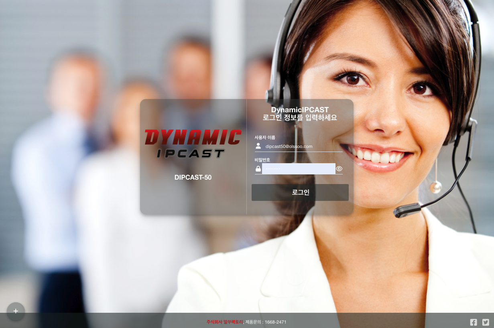
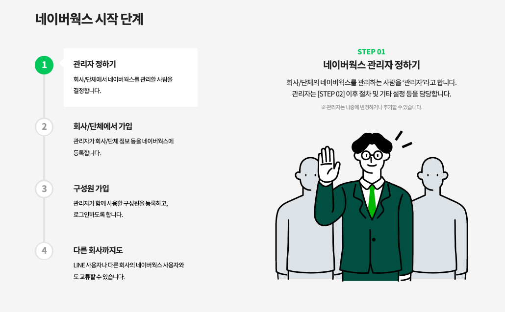
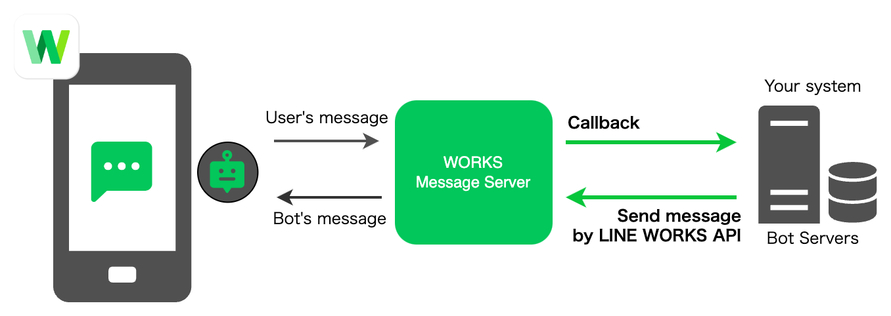
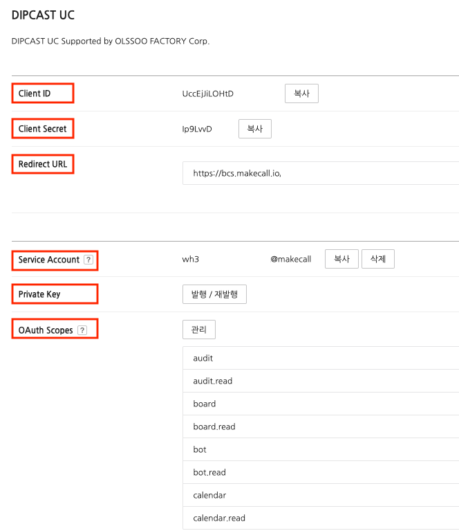
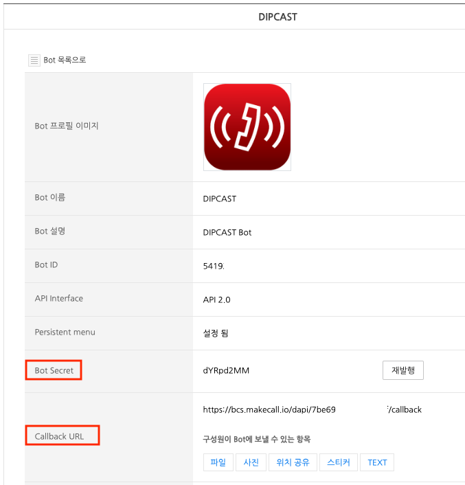
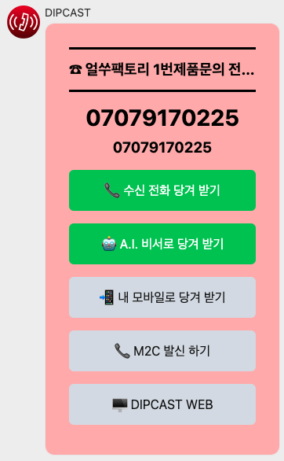
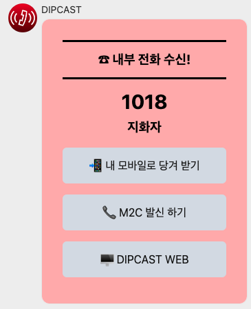
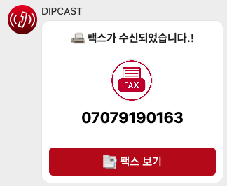

# DIPCAST - CUSTOM

Naver Works API 연동을 통해, 모바일 UC 환경 직접 구축하기
***
<br>

<center></center>
<br>
<div style="text-align: right"><span style="color:#00498c"><b>DynamicIPCAST(다이나믹 아이피캐스트)</b></span>와 네이버 웍스 API 연동</div>

<div style="text-align: right">당신의 더 나은 커뮤니케이션 여정을 함께합니다.</div>
<div style="text-align: right"><b>주식회사 얼쑤팩토리</b></div>
<div style="text-align: right">대표번호 1668-2471</div>

<br>
<br>

> # 문서 정보

| 항목 | 내용 |
|:---:|:---:|
| 버전 | 1.0 |
| 상태 | 완료 |
| 작성자 | 주식회사 얼쑤팩토리 |        

     
> # 목차  

가. 서비스 안내......3     
나. 제품 설치 환경......3     
다. 제품 개요 및 설명.....4     
라. 웹 기본......4     
마. 네이버 웍스......8     
바. 부록......55      

<br>
<br>
<br>
<br>
<br>
<br>
<br>
<br>
<br>
<br>
<br>
<br>
<br>
<br>
<br>
<br>
<br>
<br>
<br>
<br>
<br>
<br>
<br>
<br>
<br>
<br>
<br>
<br>
<br>
<br>
<br>
<br>
<br>
<br>
<br>
<br>

# 가. 서비스 안내
<br>      

> ### 1. A/S 지원

* 하드웨어 보증은 제품 구매 후 1년 이내 무상 지원되며, 1년 경과 시에는 유상 지원됩니다.

> ### 2. 고객센터 (**사용 문의 및 고장 접수**)

* ```전화번호``` 1668 - 2471
* ```운영 시간``` 10:00 ~ 18:00(월~금) / 법정 공휴일 및 주말 휴무
* ```홈페이지``` <https://www.makecall.io>

<br>       

# 나. 제품 설치 환경
<br>      

> ### 1. 다양한 네트워크 환경을 지원

* ```인터넷 전화 서비스를 사용```하려면, ```인터넷에 연결```되어 있어야 합니다.
* 일부 보안장비나 공유기(```VoIP```, ```SIP``` 지원여부에 따라)는 <u>음성통화에 문제가 발생</u>할 수 있습니다.
* ```독립 네트워크나 패쇄망```에 구축이 가능합니다.
* ```방화벽, VPN```등 보안 장비에 하단에 구축이 가능합니다.
* DIPCAST-50 제품은 팬이 없는 구성으로 ```스마트 팜```등과 같은 ```IoT```환경에 최적화 되어 있습니다.

> ### 2. DynamicIPCAST 일체형 Spec

|항 목| DIPCAST-50 |DIPCAST-100 |
|:---:|:---:|:---:|
| CPU | 4 Core 2.0GHz | 4 Core 2.0GHz |
| RAM | 8GB | 8GB |
| DISK(운영)| 512GB (SSD)|512GB (SSD)|
| 네트워크 | 1000M/100M (4포트) |1000M/100M (4포트) |  
| USB | 버젼 2 X 2, 버젼 3 X 1 (4포트)|버젼 2 (2포트)|
|제품크기| 128mm *128mm* 41mm(L *W* H) |430mm *250.20mm* 46mm(L *W* H)|
| 전원 | 12V/5A (DC IN Jack,외부 어댑터) | AC 110V ~ 220V, AC to DC, 60W (파워 내장)|
| 동작온도 | -10℃ ~ 60℃ |-10℃ ~ 60℃ |  
| 동작습도 | 5%-95%, no condensing |  5%-95%, no condensing |
| 동작진동 | 0.5g rms/5-500HZ/random/operating | 0.5g rms/5-500HZ/random/operating |

> ### 3. DynamicIPCAST VoIP 성능

|항 목|DIPCAST-50 |DIPCAST-100|비 고|
|:---:|:---:|:---:|:---:|
| 단말운용 | 50 | 100 | 멀티 등록 사용시 개수에 포함됨 |
| 동시통화 | 25 | 50 | 통화 녹음 사용시 기준 (녹취 및 부가 앱 사용 포함) |
| 최대단말 | 100 | 300 | 멀티 등록 사용시 개수에 포함됨 |

<br>

# 다. 제품 개요 및 설명
>
> ```DynamicIPCAST``` (다이나믹 캐스트) 제품은 ```SIP프로토콜을 사용하는 장비```나 ```인터넷전화 사업자 장비```와 연동을 제공하여 기존 ```음성통화 서비스의 제공 범위를 확장(IVR, ARS, ACS, CTI, CRM, STT, TTS)```시키거나 ```DynamicIPCAST```가 자체 보유한 ```음성회의```, ```음성방송```, ```음성녹음```, ```자동응답```등의 기능을 연계하여 사용할 수 있는 제품입니다.

# 라. 웹 기본
>
> ### 1. 로그인
>
> ### ```DynamicIPCAST```을 사용하기 위해, 서버에 설정된 IP를 인터넷 브라우져에 입력하고 아래의 접속정보를 입력하여 ```관리자웹에 로그인```합니다
>
> * (1) 사용자 이름을 입력합니다. (기본:<dipcast@makecall.io>)
> * (2) 비밀번호을 입력합니다. (기본:ihavenopassword@)
> 
> <br>
> <br>

# 마. 네이버 웍스 (<https://naver.worksmobile.com/>)
>
> ### 1. 네이버웍스란?
> 네이버웍스는 네이버/LINE 서비스와 유사한 화면으로
> 누구나 쉽게 사용할 수 있는 업무용 메신저입니다.
> 메시지로 직장 동료들과 소통하며, 네이버웍스만의 그룹 기능으로
> 유기적인 협업을 가능하게 합니다.
> 타사의 네이버웍스 사용자는 물론 LINE 사용자와도 대화를 나눌 수 있어
> 고객 또는 거래처와의 소통 채널을 일원화합니다.
>
> * ```공인 홈 링크``` <https://naver.worksmobile.com/feature/overview/>

> ### 2. 네이버웍스 가입 안내
>
> 네이버웍스는 회사나 단체에서 가입하여 사용하는 서비스입니다.
> 개인이 각각 가입하는 것이 아닌 회사나 단체당 하나의 네이버웍스를 먼저 가입한 후,
> 가입한 사람(관리자)이 함께 일하는 직원을 초대하거나 추가해서 구성원을 늘립니다.
> 아래의 가입 안내 링크에 따라, 가입하세요.
>
> 
>
> * ```가입 안내 링크``` <https://naver.worksmobile.com/ebook/video-for-beginner/>

> ### 3. NAVER WORKS API 2.0
>
> NAVER WORKS API는 NAVER WORKS와의 연동 기능을 제공합니다.
> 개발자는 NAVER WORKS API를 사용하여 Bot 사용, 조직 및 그룹 관리, 파일 업로드/다운로드 등 NAVER WORKS에서 제공하는 다양한 기능과 리소스를 활용하는 앱을 개발할 수 있습니다.
> NAVER WORKS의 봇, 게시판, 캘린더, 주소록, 메일, 드라이브 등 다양한 기능을 일관적인 인터페이스의 REST API로 활용해보세요.
>
> * ```공인 문서 링크``` <https://developers.worksmobile.com/kr/features/api>
> <br>
> <br>
> <br>       

> ### 4. NAVER WORKS API 2.0 - Bot
>
> Bot API로 Bot에서 메시지를 보내거나, 메뉴를 설정하고, Bot을 관리할 수 있다.
> Bot API를 호출하려면 구성원 계정 또는 서비스 계정으로 인증하여 얻은 Access Token이 필요하다. API scope는 bot, bot.read이다.
>
> * ```공인 문서 링크``` <https://developers.worksmobile.com/kr/docs/bot-api>
>
> * Bot의 작동 방식
> Bot을 사용하면 NAVER WORKS 사용자와 직접 상호 작용할 수 있다. 고객사의 메시지 수신 서버에서 Bot API를 사용해 사용자에게 메시지를 보낼 수 있으며, 사용자가 전송한 메시지에 따라 자동으로 응답할 수 있다.
> 
> NAVER WORKS는 Bot의 인터페이스 제공하며 이를 통해 고객사의 메시지 수신 서버와 데이터를 주고 받을수 있다.

> ### 5. NAVER WORKS Developer Console 설정
>
> NAVER WORKS Developer Console (<https://dev.worksmobile.com/kr/console>)에 로그인 후 API 2.0 탭에서 앱을 추가 하고, Bot 탭에서는 Bot을 등록합니다.
>
> * Developer Console 화면
>
> 
>
> * 앱 설정 화면     
> 
>
> * 봇 설정 화면     
> 

> ### 6. 네이버웍스 봇에 수신 메세지 목록
>
> * 외부수신     
> 

> * 내부수신     
> 

> * 팩스수신     
> 
