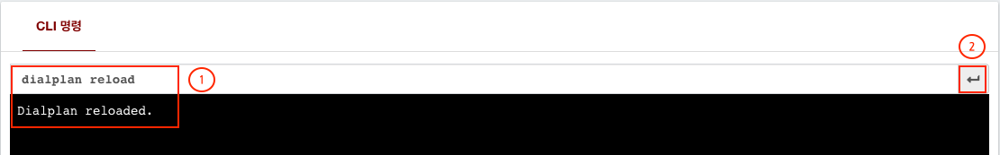
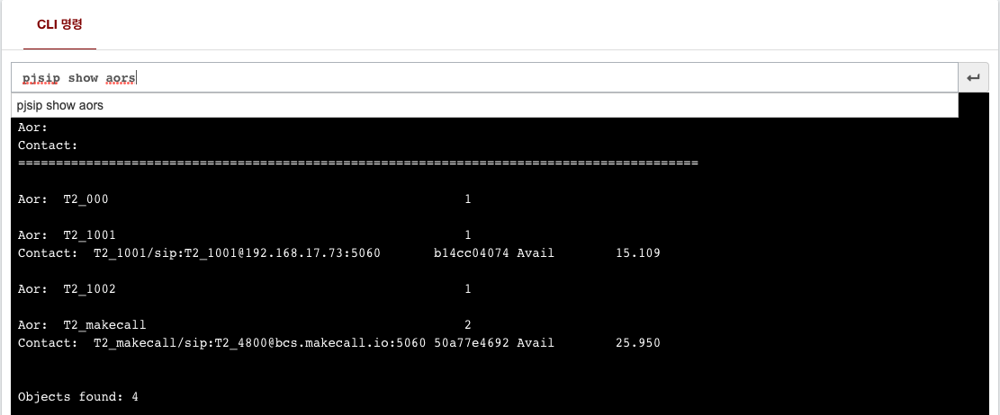

# DIPCAST - CUSTOM

Config Reload 방법
***

### DIPCAST GUI

> ```VOIP``` > ```도구``` > ```CLI```
>
> * (1) CLI ```명령어를 입력```합니다.
> * (2) ```실행버튼을 클릭```하거나, ```엔터를 눌러 실행```하고 ```결과를 확인```합니다.
> * ```다이얼플랜 리로드``` (변경된 다이얼플랜을 적용할 때)
> 
>
> * ```PJSIP AORS (Address of Record)정보``` 출력
> 
>
> ### 1.6.2. 발신자 번호 라우팅
>
> ```VOIP``` > ```도구``` > ```발신자 번호 라우팅```
>
> * (1) 발신자 번호 라우팅에 적용할 번호를 입력합니다.
> * (2) 발신자 번호 라우팅을 구분 할 수 있는 설명을 입력합니다.  
> * (3) 등록된 발신자 번호의 라우팅 대응 경로를 선택합니다.
> * (4) ```우측 하단```에  버튼을 눌러 설정을 ```저장```합니다.
> * ```우측 상단```에  버튼을 눌러 ```설정을 완료하고 시스템에 반영```합니다.

