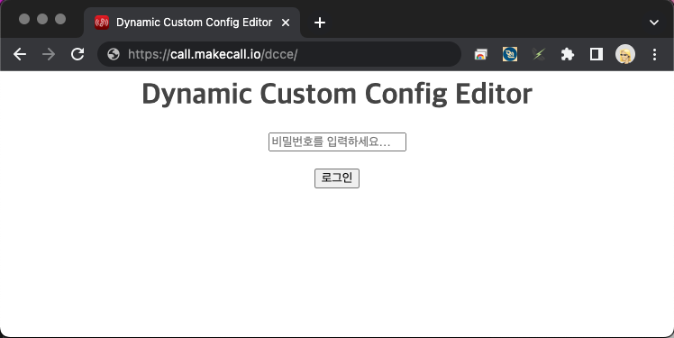
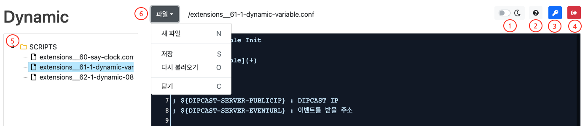
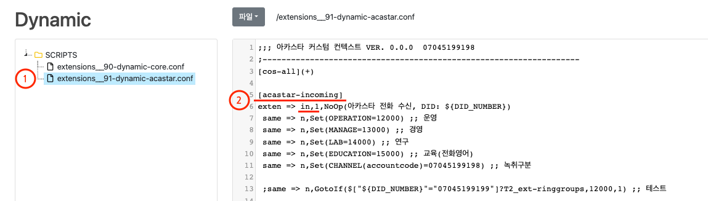
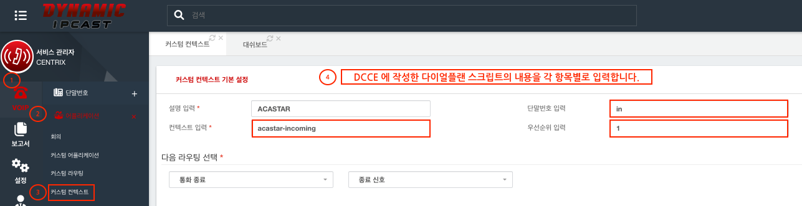

# DIPCAST - CUSTOM

DIPCAST에서 자기만의 비지니스 서비스 만드는 방법     
How to develop your own business services on DIPCAST!
***

## DIPCAST 구매

> <br>     
> 홈페이지 : https://www.makecall.io     
> 구매문의 : 1668-2471     
> 구매링크 : [네이버 스마트 스토어](https://smartstore.naver.com/olssoo/)     
***

## Dynamic Custom Config Editor 사용
### 접속방법
> 1. 웹 브라우져를 열고, 주소창에 http://```IP주소```/dcce를 입력합니다. 
> 1. 비밀번호를 입력하고 로그인 번호를 입력합니다.
> 

### 기본 메뉴 설명
> 1. 다크모드로 전환합니다.
> 1. 설정(config) 리로드 명령을 출력합니다.
> 1. 비밀번호 변경합니다.
> 1. 프로그램을 종료합니다.
> 1. 수정할 스크립트 파일 목록을 출력합니다.
> 1. 파일을 관리합니다.
>       1. ```S``` 파일을 저장합니다.
>       1. ```O``` 파일을 다시불러옵니다.
>       1. ```C``` 파일을 닫습니다.
> 

### DCCE 스크립트 파일 수정 (전화수신시 DID 번호별로 각기 다른 링그룹으로 수신통화를 분기)
> 1. 파일 목록에서 수정할 스크립트 파일을 클릭합니다.
> 1. 스크립트를 수정하고, 저장합니다.
> ```
> [cos-all](+)
> 
> [acastar-incoming]
> exten => in,1,NoOp(아카스타 전화 수신, DID: ${DID_NUMBER})
>  same => n,Set(OPERATION=12000) ;; 운영
>  same => n,Set(MANAGE=13000) ;; 경영
>  same => n,Set(LAB=14000) ;; 연구
>  same => n,Set(EDUCATION=15000) ;; 교육(전화영어)
>  same => n,Set(CHANNEL(accountcode)=07043199999) ;; 녹취구분
> 
>  ;same => n,GotoIf($["${DID_NUMBER}"="07043199999"]?T2_ext-ringgroups,12000,1) ;; 테스트
> ```
> 
### DIPCAST VOIP > 어플리케이션 > 커스텀 컨텍스트에 적용
> 1. 좌측 메뉴에 ```VOIP```를 클릭합니다. 
> 1. 좌측 메뉴에 ```어플리케이션```을 클릭합니다.
> 1. 좌측 메뉴에 ```커스텀 컨텍스트```를 클릭합니다.
> 1. ```DCCE```에서 작성한 스크립트 내용을 확인하여 각 항목에 맞게 입력합니다.
>       1. context : ```acastar-incoming```
>       1. exten : ```IN```
>       1. priority : ```1```
> 

## CUSTOM 사운드 파일 재생 및 목록
[CUSTOM 사운드](SOUND.md) 사용 하기

## 스크립트 템플릿 (ing...)
목록을 클릭후, 스크립트를 이름과 내용을 복사하여 DCCE에 적용하고, [다이얼플랜 리로드](CONFIG-RELOAD.md)를 합니다.
파일의 이름은 반드시 ```extensions__6``` 으로 시작되어야 합니다.
> * [Dynamic 기본 변수](resources/templates/extensions__61-1-dynamic-varible.conf) 
> * 080 수신거부
> * DTMF 입력
> * TTS
> * 샘플 IVR
> * 음성통화에 네이버 TTS 적용하기

